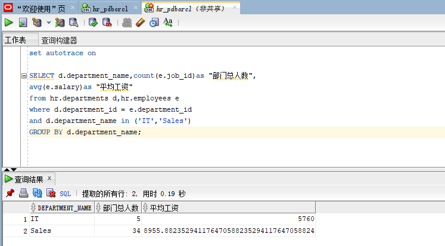

##### 学号：201810424304   姓名：谢芳煊  班级：软工2班
#### 实验一   SQL语句的执行计划分析与优化指导
##### 实验目的：
    分析SQL执行计划，执行SQL语句的优化指导。理解分析SQL语句的执行计划的重要作用。
##### 实验内容：
    （1）执行教材中的查询语句：
``` sql
    【查询语句1：】
    SELECT d.department_name,count(e.job_id)as "部门总人数",
    avg(e.salary)as "平均工资"
    from hr.departments d,hr.employees e
    where d.department_id = e.department_id
    and d.department_name in ('IT','Sales')
    GROUP BY d.department_name;
    【查询语句2：】
    SELECT d.department_name,count(e.job_id)as "部门总人数",
    avg(e.salary)as "平均工资"
    FROM hr.departments d,hr.employees e
    WHERE d.department_id = e.department_id
    GROUP BY d.department_name
    HAVING d.department_name in ('IT','Sales');
```
    查询语句1和2执行结果：由图可知查询语句2的执行效率比1高。
##### 


#####
    第二种方法比第一种方法效率高，对第二种方法进行优化指导，没有给出优化建议，说明已是最优


##### 
    (2)设计自己的SQL查询语句并执行优化指导
```sql
    【查询语句：】
    SELECT d.department_name,count(e.job_id)as "部门总人数",
    avg(e.salary)as "平均工资"
    from hr.departments d
    INNER JOIN
    hr.employees e
    on d.department_id = e.department_id
    and d.department_name='IT'
    OR  d.department_name='Sales'
    GROUP BY d.department_name;
```
       【运行结果及优化指导：】


##### 实验总结：
     通过本次实验，了解掌握了如何分析SQL执行计划，和用sqldeveloper执行SQL语句的优化指导。
     理解了分析SQL语句的执行计划的重要作用。除此之外，还学习了解了如何用Markdown格式来编写文档。
  
   


