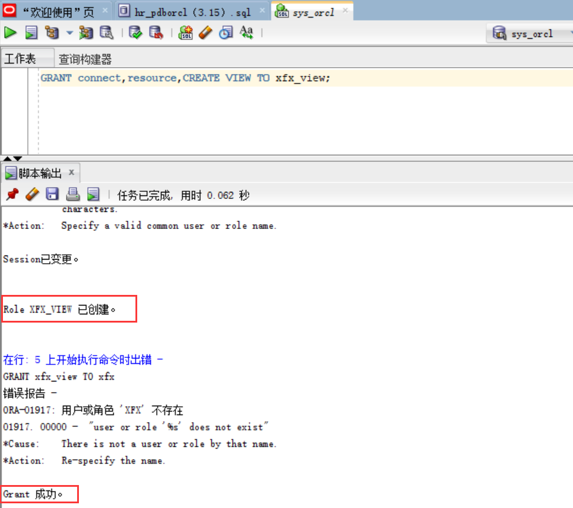
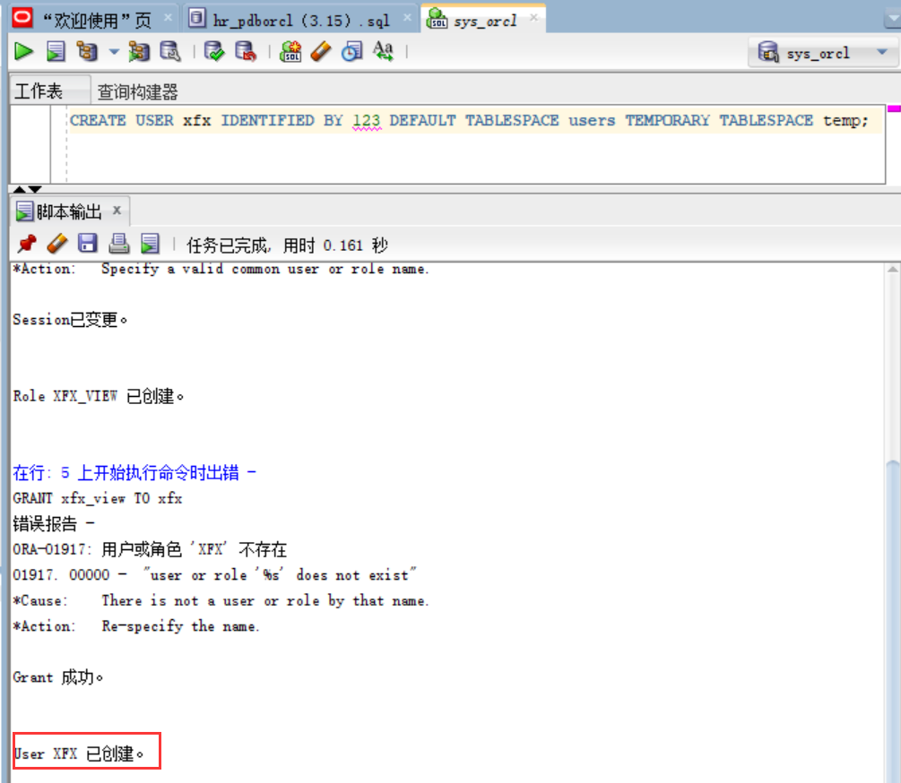
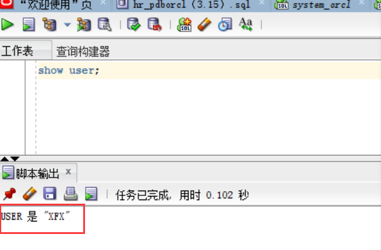
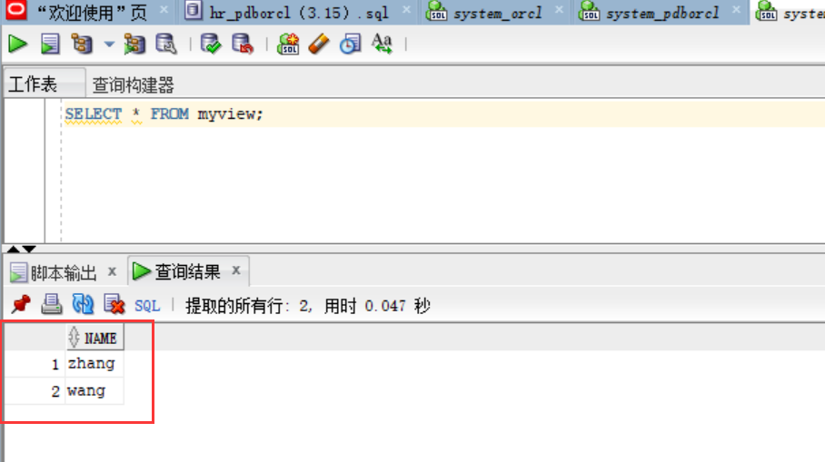
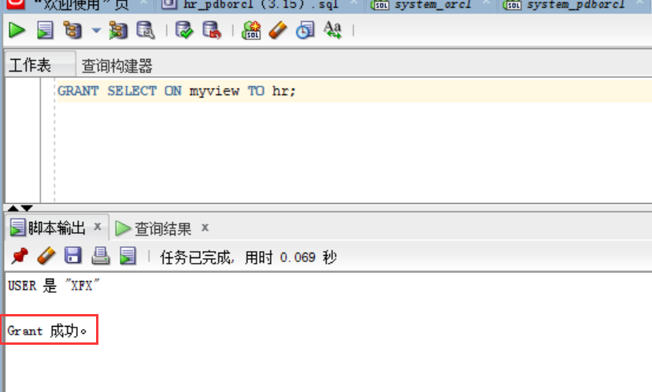
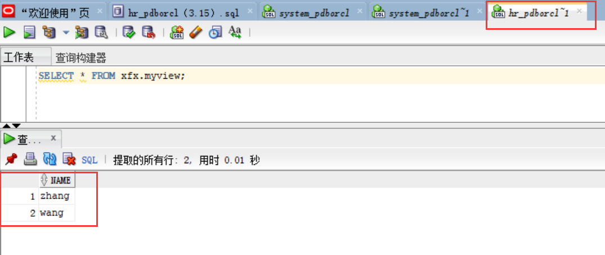

##### 学号：201810424304   姓名：谢芳煊  班级：软工2班
#### 实验二   用户及权限管理
##### 实验目的：
    掌握用户管理、角色管理、权根维护与分配的能力，掌握用户之间共享对象的操作技能。
##### 实验内容：
    Oracle有一个开发者角色resource，可以创建表、过程、触发器等对象，但是不能创建视图。本训练要求：
    (1)在pdborcl插接式数据中创建一个新的本地角色con_res_view，该角色包含connect和resource角色，同时也包含CREATE VIEW权限，这样任何拥有con_res_view的用户就同时拥有这三种权限。
    (2)创建角色之后，再创建用户new_user，给用户分配表空间，设置限额为50M，授予con_res_view角色。
    (3)最后测试：用新用户new_user连接数据库、创建表，插入数据，创建视图，查询表和视图的数据。
##### 实验步骤：
``` sql
（1）以system登录到pdborcl，创建角色xfx_view和用户xfx，并授权和分配空间：

    CREATE ROLE xfx_view;
    GRANT connect,resource,CREATE VIEW TO xfx_view;
    CREATE USER xfx IDENTIFIED BY 123 DEFAULT TABLESPACE users TEMPORARY TABLESPACE temp;
    ALTER USER xfx QUOTA 50M ON users;
    GRANT xfx_view TO xfx;
    exit;
```



``` sql
 (2)新用户xfx连接到pdborcl，创建表mytable和视图myview，插入数据，最后将myview的SELECT对象权限授予hr用户。

    show user;
    CREATE TABLE mytable (id number,name varchar(50));
    INSERT INTO mytable(id,name)VALUES(1,'zhang');
    INSERT INTO mytable(id,name)VALUES (2,'wang');
    CREATE VIEW myview AS SELECT name FROM mytable;
    SELECT * FROM myview;
    GRANT SELECT ON myview TO hr;

```



#####
``` sql
 (3)用户hr连接到pdborcl，查询new_user授予它的视图myview
    SELECT * FROM xfx.myview;
```


##### 实验总结：
     通过本次实验，了解掌握了如何进行用户管理、角色管理、权限维护与分配，掌握了用户之间共享对象的操作技能。
     除此之外，还更加熟练了使用Markdown格式来编写文档以及将文档上传至github的操作。
  
   


