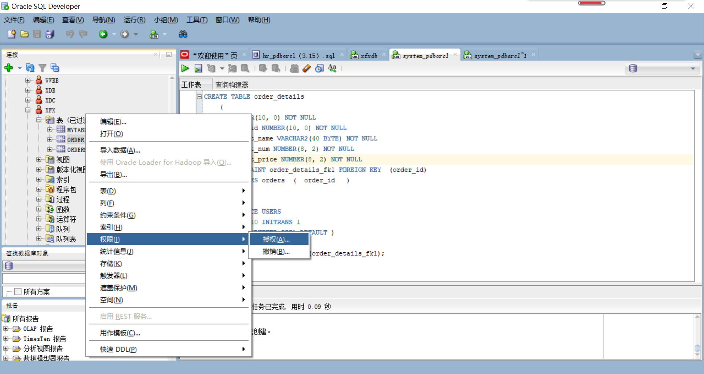

##### 学号：201810424304   姓名：谢芳煊  班级：软工2班
#### 实验三   创建分区表
##### 实验目的：
    掌握分区表的创建方法，掌握各种分区方式的使用场景。
##### 实验内容：
    （1）本实验使用3个表空间：USERS,USERS02,USERS03。在表空间中创建两张表：订单表(orders)与订单详表(order_details)。
    （2）使用你自己的账号创建本实验的表，表创建在上述3个分区，自定义分区策略。
    （3）你需要使用system用户给你自己的账号分配上述分区的使用权限。你需要使用system用户给你的用户分配可以查询执行计划的权限。
    （4）表创建成功后，插入数据，数据能并平均分布到各个分区。每个表的数据都应该大于1万行，对表进行联合查询。
    （5）写出插入数据的语句和查询数据的语句，并分析语句的执行计划。进行分区与不分区的对比实验
##### 实验步骤：
``` sql
（1）在用户xfx中创建表：orders（订单表）

     CREATE TABLE ORDERS
    (ORDER_ID NUMBER(10, 0) NOT NULL, 
     CUSTOMER_NAME VARCHAR2(40 BYTE) NOT NULL, 
     CUSTOMER_TEL VARCHAR2(40 BYTE) NOT NULL, 
     ORDER_DATE DATE NOT NULL, 
     EMPLOYEE_ID NUMBER(6, 0) NOT NULL, 
     DISCOUNT NUMBER(8, 2) DEFAULT 0, 
     TRADE_RECEIVABLE NUMBER(8, 2) DEFAULT 0, 
     CONSTRAINT ORDERS_PK PRIMARY KEY
      (
        ORDER_ID
      )
      USING INDEX
      (
        CREATE UNIQUE INDEX ORDERS_PK ON ORDERS (ORDER_ID ASC)
      LOGGING
      TABLESPACE USERS
      PCTFREE 10
      INITRANS 2
      STORAGE
      (
        BUFFER_POOL DEFAULT
      )
      NOPARALLEL
      )
      ENABLE
    )
    TABLESPACE USERS
    PCTFREE 10
    INITRANS 1
    STORAGE
    (
      BUFFER_POOL DEFAULT
    )
    NOCOMPRESS
    NOPARALLEL
    PARTITION BY RANGE (ORDER_DATE)
    (
      PARTITION PARTITION_2015 VALUES LESS THAN (TO_DATE    ('2016-01-01 00:00:00', 'SYYYY-MM-DD     HH24:MI:SS',     'NLS_CALENDAR=GREGORIAN'))
      NOLOGGING
      TABLESPACE USERS
      PCTFREE 10
      INITRANS 1
      STORAGE
      (
        INITIAL 8388608
        NEXT 1048576
        MINEXTENTS 1
        MAXEXTENTS UNLIMITED
        BUFFER_POOL DEFAULT
      )
      NOCOMPRESS NO INMEMORY
    , PARTITION PARTITION_2016 VALUES LESS THAN (TO_DATE    ('2017-01-01 00:00:00', 'SYYYY-MM-DD     HH24:MI:SS',     'NLS_CALENDAR=GREGORIAN'))
      NOLOGGING
      TABLESPACE USERS
      PCTFREE 10
      INITRANS 1
      STORAGE
      (
        BUFFER_POOL DEFAULT
      )
      NOCOMPRESS NO INMEMORY
    , PARTITION PARTITION_2017 VALUES LESS THAN (TO_DATE    ('2018-01-01 00:00:00', 'SYYYY-MM-DD     HH24:MI:SS',     'NLS_CALENDAR=GREGORIAN'))
      NOLOGGING
      TABLESPACE USERS
      PCTFREE 10
      INITRANS 1
      STORAGE
      (
        BUFFER_POOL DEFAULT
      )
      NOCOMPRESS NO INMEMORY
    , PARTITION PARTITION_2018 VALUES LESS THAN (TO_DATE    ('2019-01-01 00:00:00', 'SYYYY-MM-DD     HH24:MI:SS',     'NLS_CALENDAR=GREGORIAN'))
      NOLOGGING
      TABLESPACE USERS02
      PCTFREE 10
      INITRANS 1
      STORAGE
      (
        BUFFER_POOL DEFAULT
      )
      NOCOMPRESS NO INMEMORY
    , PARTITION PARTITION_2019 VALUES LESS THAN (TO_DATE    ('2020-01-01 00:00:00', 'SYYYY-MM-DD     HH24:MI:SS',     'NLS_CALENDAR=GREGORIAN'))
      NOLOGGING
      TABLESPACE USERS02
      PCTFREE 10
      INITRANS 1
      STORAGE
      (
        BUFFER_POOL DEFAULT
      )
      NOCOMPRESS NO INMEMORY
    , PARTITION PARTITION_2020 VALUES LESS THAN (TO_DATE    ('2021-01-01 00:00:00', 'SYYYY-MM-DD     HH24:MI:SS',     'NLS_CALENDAR=GREGORIAN'))
      NOLOGGING
      TABLESPACE USERS02
      PCTFREE 10
      INITRANS 1
      STORAGE
      (
        BUFFER_POOL DEFAULT
      )
      NOCOMPRESS NO INMEMORY
    , PARTITION PARTITION_2021 VALUES LESS THAN (TO_DATE    ('2022-01-01 00:00:00', 'SYYYY-MM-DD     HH24:MI:SS',     'NLS_CALENDAR=GREGORIAN'))
      NOLOGGING
      TABLESPACE USERS03
      PCTFREE 10
      INITRANS 1
      STORAGE
      (
        BUFFER_POOL DEFAULT
      )
      NOCOMPRESS NO INMEMORY
       );

```

.png)
``` sql
 (2)在用户xfx中创建表：order_details（订单详情表）

    CREATE TABLE order_details
    (
    id NUMBER(10, 0) NOT NULL,
     order_id NUMBER(10, 0) NOT NULL, 
     product_name VARCHAR2(40 BYTE) NOT NULL, 
     product_num NUMBER(8, 2) NOT NULL, 
     product_price NUMBER(8, 2) NOT NULL, 
     CONSTRAINT order_details_fk1 FOREIGN KEY  (order_id)
     REFERENCES orders  (  order_id   )
     ENABLE
    )
    TABLESPACE USERS
    PCTFREE 10 INITRANS 1
    STORAGE (BUFFER_POOL DEFAULT )
    NOCOMPRESS NOPARALLEL
    PARTITION BY REFERENCE (order_details_fk1);


```
.png)
#####
``` sql
 (3)以system用户修改xfx用户的权限
```





``` sql
 (4)对有分区表执行计划分析
```


``` sql
 (5)以用户xfx创建无分区表
    CREATE TABLE ORDERS_NOSPACE 
    (
      ORDER_ID NUMBER(10, 0) NOT NULL, 
      CUSTOMER_NAME VARCHAR2(40 BYTE) NOT NULL, CUSTOMER_TEL VARCHAR2(40 BYTE) NOT NULL , 
      ORDER_DATE DATE NOT NULL , 
      EMPLOYEE_ID NUMBER(6, 0) DEFAULT 0 , 
      DISCOUNT NUMBER(8, 2) DEFAULT 0 , 
      CONSTRAINT ORDERS_ID_ORDERS_DETAILS PRIMARY KEY 
      (
        ORDER_ID 
      )
      USING INDEX 
      (
          CREATE UNIQUE INDEX ORDERS_ID_ORDERS_DETAILS ON     ORDERS_NOSPACE (ORDER_ID ASC) 
          LOGGING 
          TABLESPACE USERS 
          PCTFREE 10 
          INITRANS 2 
          STORAGE 
          ( 
            BUFFER_POOL DEFAULT 
          ) 
          NOPARALLEL 
      )
      ENABLE 
    ) 
    LOGGING 
    TABLESPACE USERS 
    PCTFREE 10 
    INITRANS 1 
    STORAGE 
    ( 
      BUFFER_POOL DEFAULT 
    ) 
    NOCOMPRESS 
    NO INMEMORY 
    NOPARALLEL;
    
    #建立orders_details_nospace表
    CREATE TABLE ORDER_DETAILS_NOSPACE 
    (
      ID NUMBER(10, 0) NOT NULL , 
      ORDER_ID NUMBER(10, 0) NOT NULL , 
      PRODUCT_NAME VARCHAR2(40 BYTE) NOT NULL , 
      PRODUCT_NUM NUMBER(8, 2) NOT NULL , 
      PRODUCT_PRICE NUMBER(8, 2) NOT NULL 
    ) 
    LOGGING 
    TABLESPACE USERS 
    PCTFREE 10 
    INITRANS 1 
    STORAGE 
    ( 
      INITIAL 65536 
      NEXT 1048576 
      MINEXTENTS 1 
      MAXEXTENTS UNLIMITED 
      BUFFER_POOL DEFAULT 
    ) 
    NOCOMPRESS 
    NO INMEMORY 
    NOPARALLEL;
    
    ALTER TABLE ORDER_DETAILS_NOSPACE
    ADD CONSTRAINT ORDERS_FOREIGN_ORDERS_DETAILS FOREIGN KEY
    (
      ORDER_ID 
    )
    REFERENCES ORDERS_NOSPACE
    (
      ORDER_ID 
    )
    ENABLE;

```


``` sql
 (6)对无分区表执行计划分析
```


##### 实验总结：
     通过本次实验，了解掌握了分区表的创建方法和各种分区方式的使用场景。知道了若在分区表里查询数据，
     同一个分区查找明显比不同分区查找快，分区表在数据量大时进行查找更快效率更高，但当数据小的时候有无分区的查找速度差别不大。
     除此之外，还更加熟练了使用Markdown格式来编写文档以及将文档上传至github的操作。
  
   


