##### 学号：201810424304   姓名：谢芳煊  班级：软工2班
#### 实验六（期末考核）   基于Oracle的校园论坛数据库设计
##### 期末考核要求：
    (1)自行设计一个信息系统的数据库项目，自拟项目名称。
    (2)设计项目涉及的表及表空间使用方案。至少5张表和5万条数据，两个表空间。
    (3)设计权限及用户分配方案。至少两类角色，两个用户。
    (4)在数据库中建立一个程序包，在包中用PL/SQL语言设计一些存储过程和函数，实现比较复杂的业务逻辑，
       用模拟数据进行执行计划分析。
    (5)设计自动备份方案或者手工备份方案。
    (6)设计容灾方案。使用两台主机，通过DataGuard实现数据库整体的异地备份（可选）

##### 一、背景：
      在当今网络技术快速发展的时代，已经不是“日新月异”就能形容的信息化世界里，动态性、交互性与时速
    性的网络论坛成为其中最快速、最丰富和最自由的网络信息资源，也是最受广大的现代人类欢迎的信息交流方式
    之一。校园论坛网给各个大学的大学生提供了一个良好的交流学习平台，同学们可以在论坛上发表或评论帖子实
    现相互之间的学习交流。

##### 二、创建表空间：
```sql
1.创建space01
    CREATE TABLESPACE space01 DATAFILE
    '/home/oracle/app/oracle/oradata/orcl/cams/space01_1.dbf'
    SIZE 100M AUTOEXTEND ON NEXT 10M MAXSIZE UNLIMITED,
    '/home/oracle/app/oracle/oradata/orcl/cams/space01_2.dbf'
    SIZE 100M AUTOEXTEND ON NEXT 10M MAXSIZE UNLIMITED
    EXTENT MANAGEMENT LOCAL SEGMENT SPACE MANAGEMENT AUTO;
```
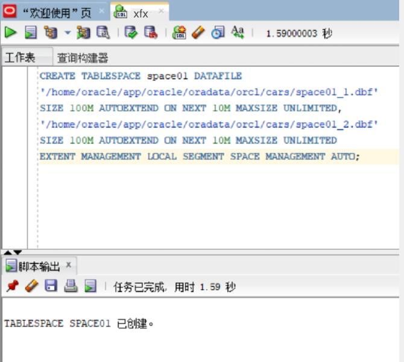

```sql
2.创建表空间sapce02
    CREATE TABLESPACE space02 DATAFILE
    '/home/oracle/app/oracle/oradata/orcl/cams/space02_1.dbf'
    SIZE 100M AUTOEXTEND ON NEXT 10M MAXSIZE UNLIMITED,
    '/home/oracle/app/oracle/oradata/orcl/cams/space02_2.dbf'
    SIZE 100M AUTOEXTEND ON NEXT 10M MAXSIZE UNLIMITED
    EXTENT MANAGEMENT LOCAL SEGMENT SPACE MANAGEMENT AUTO;
```
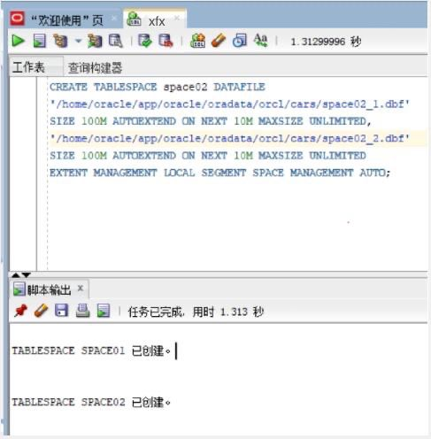

##### 三、创建角色：
```sql
1.创建管理员角色
    CREATE ROLE admins;
    GRANT create any table, alter any table, create tablespace, alter tablespace, create user, alter user,
    create any procedure, alter any procedure, create session, alter session
    to admins with admin option;
```
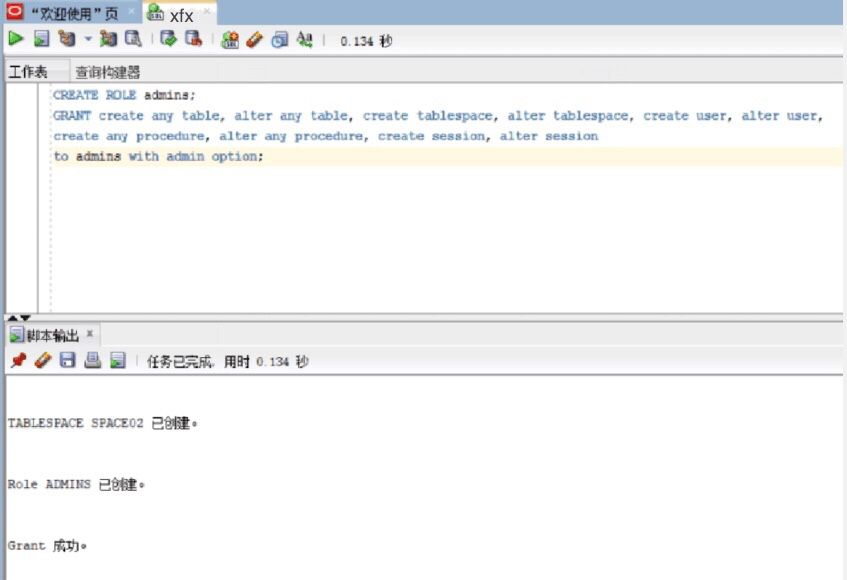

```sql
2.创建用户角色
    CREATE ROLE users;
    GRANT create session to users with admin option;
```
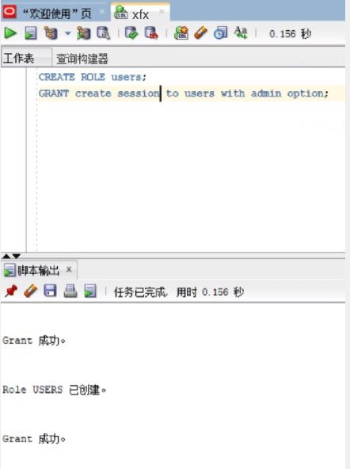


##### 四、创建用户：
```sql
1.创建管理员用户
  创建管理员用户admin_01,并赋予它所有权限
  CREATE USER user_01 IDENTIFIED by 123;
  GRANT users to user_01;
```
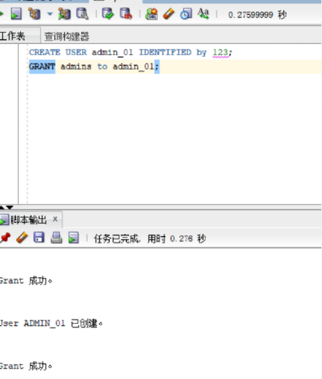

```sql
2.创建普通用户
    CREATE USER user_02 IDENTIFIED by 123;
    GRANT users to user_02;
```
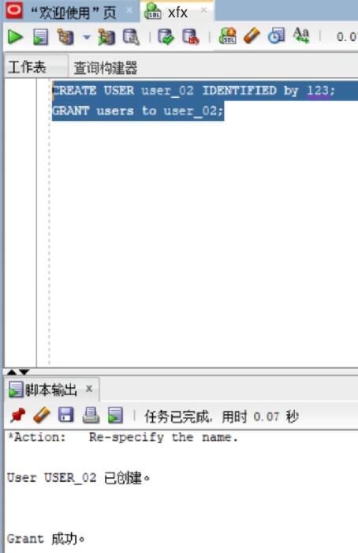

##### 五、创建表及插入数据：

```sql
1.模块表 module

DROP TABLE Module;
CREATE TABLE Module(
  "name" VARCHAR2(255 BYTE) VISIBLE NOT NULL ,
  "describe" VARCHAR2(255 BYTE) VISIBLE NOT NULL 
)
TABLESPACE "SPACE01"
LOGGING
NOCOMPRESS
PCTFREE 10
INITRANS 1
STORAGE (
  BUFFER_POOL DEFAULT
)
PARALLEL 1
NOCACHE
DISABLE ROW MOVEMENT
;
COMMENT ON COLUMN Module."name" IS '模块名';
COMMENT ON COLUMN Module."describe" IS '模块的描述';

ALTER TABLE Module ADD CONSTRAINT "SYS_C0038651" PRIMARY KEY ("name");

-- ----------------------------
-- Checks structure for table Module 
-- ----------------------------
ALTER TABLE Module ADD CONSTRAINT "SYS_C0038649" CHECK ("name" IS NOT NULL) NOT DEFERRABLE INITIAL xfx IMMEDIATE NORExfx VALIDATE;
ALTER TABLE Module ADD CONSTRAINT "SYS_C0038650" CHECK ("describe" IS NOT NULL) NOT DEFERRABLE INITIALxfx IMMEDIATE NORExfx VALIDATE;
```

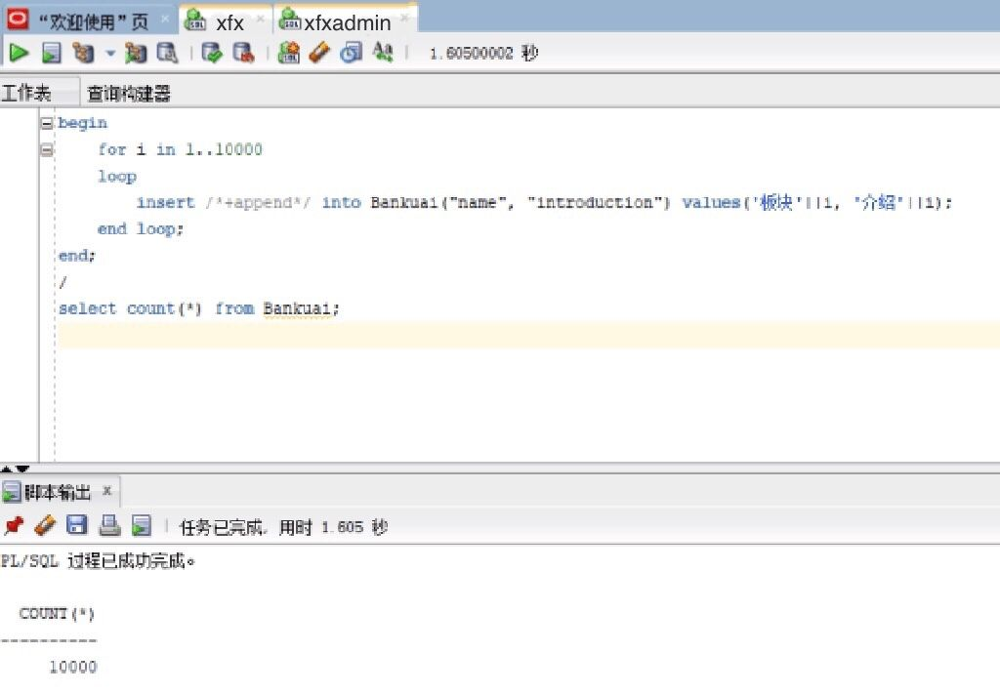

```sql
2.帖子表 topic

DROP TABLE topic;
CREATE TABLE topic(
  "id" NUMBER VISIBLE NOT NULL ,
  "name" VARCHAR2(255 BYTE) VISIBLE NOT NULL ,
  "user_id" NUMBER VISIBLE NOT NULL ,
  "title" VARCHAR2(255 BYTE) VISIBLE NOT NULL ,
  "details" VARCHAR2(255 BYTE) VISIBLE NOT NULL ,
  "time" DATE VISIBLE NOT NULL 
)
TABLESPACE "SPACE01"
LOGGING
NOCOMPRESS
PCTFREE 10
INITRANS 1
STORAGE (
  BUFFER_POOL DEFAULT
)
PARALLEL 1
NOCACHE
DISABLE ROW MOVEMENT
;
COMMENT ON COLUMN post."id" IS '话题id';
COMMENT ON COLUMN post."name" IS '所属模块名';
COMMENT ON COLUMN post."user_id" IS '发帖人id';
COMMENT ON COLUMN post."title" IS '话题标题';
COMMENT ON COLUMN post."details" IS '话题内容';
COMMENT ON COLUMN post."time" IS '发起时间';

ALTER TABLE post ADD CONSTRAINT "SYS_C0038667" PRIMARY KEY ("id");

-- ----------------------------
-- Checks structure for table topic
-- ----------------------------
ALTER TABLE topicADD CONSTRAINT "SYS_C0038661" CHECK ("id" IS NOT NULL) NOT DEFERRABLE INITIALxfx IMMEDIATE NORExfx VALIDATE;
ALTER TABLE topicADD CONSTRAINT "SYS_C0038662" CHECK ("name" IS NOT NULL) NOT DEFERRABLE INITIALxfx IMMEDIATE NORExfx VALIDATE;
ALTER TABLE topicADD CONSTRAINT "SYS_C0038663" CHECK ("user_id" IS NOT NULL) NOT DEFERRABLE INITIALxfx IMMEDIATE NORExfx VALIDATE;
ALTER TABLE topicADD CONSTRAINT "SYS_C0038664" CHECK ("title" IS NOT NULL) NOT DEFERRABLE INITIALxfx IMMEDIATE NORExfx VALIDATE;
ALTER TABLE topicADD CONSTRAINT "SYS_C0038665" CHECK ("details" IS NOT NULL) NOT DEFERRABLE INITIALxfx IMMEDIATE NORExfx VALIDATE;
ALTER TABLE topicADD CONSTRAINT "SYS_C0038666" CHECK ("time" IS NOT NULL) NOT DEFERRABLE INITIALxfx IMMEDIATE NORExfx VALIDATE;
```
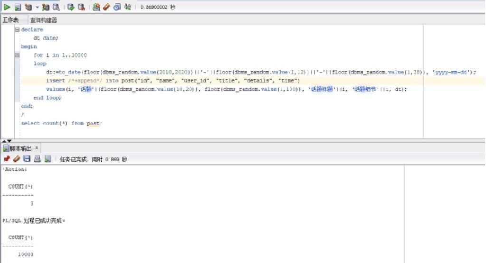

```sql
3.回帖表 reply1

DROP TABLE reply1;
CREATE TABLE reply1 (
  "id" NUMBER VISIBLE NOT NULL ,
  "post_id" NUMBER VISIBLE NOT NULL ,
  "user_id" NUMBER VISIBLE NOT NULL ,
  "details" VARCHAR2(255 BYTE) VISIBLE NOT NULL ,
  "time" DATE VISIBLE NOT NULL 
)
TABLESPACE "SPACE01"
LOGGING
NOCOMPRESS
PCTFREE 10
INITRANS 1
STORAGE (
  BUFFER_POOL DEFAULT
)
PARALLEL 1
NOCACHE
DISABLE ROW MOVEMENT
;
COMMENT ON COLUMN reply."id" IS '回帖id';
COMMENT ON COLUMN reply."post_id" IS '话题id';
COMMENT ON COLUMN reply."user_id" IS '回复用户id';
COMMENT ON COLUMN reply."details" IS '回复内容';
COMMENT ON COLUMN reply."time" IS '回复时间';

ALTER TABLE reply ADD CONSTRAINT "SYS_C0038673" PRIMARY KEY ("id", "post_id");

-- ----------------------------
-- Checks structure for table reply1
-- ----------------------------
ALTER TABLE reply ADD CONSTRAINT "SYS_C0038668" CHECK ("id" IS NOT NULL) NOT DEFERRABLE INITIALxfx IMMEDIATE NORExfx VALIDATE;
ALTER TABLE reply ADD CONSTRAINT "SYS_C0038669" CHECK ("post_id" IS NOT NULL) NOT DEFERRABLE INITIALxfx IMMEDIATE NORExfx VALIDATE;
ALTER TABLE reply ADD CONSTRAINT "SYS_C0038670" CHECK ("user_id" IS NOT NULL) NOT DEFERRABLE INITIALxfx IMMEDIATE NORExfx VALIDATE;
ALTER TABLE reply ADD CONSTRAINT "SYS_C0038671" CHECK ("details" IS NOT NULL) NOT DEFERRABLE INITIALxfx IMMEDIATE NORExfx VALIDATE;
ALTER TABLE reply ADD CONSTRAINT "SYS_C0038672" CHECK ("time" IS NOT NULL) NOT DEFERRABLE INITIALxfx IMMEDIATE NORExfx VALIDATE;
```
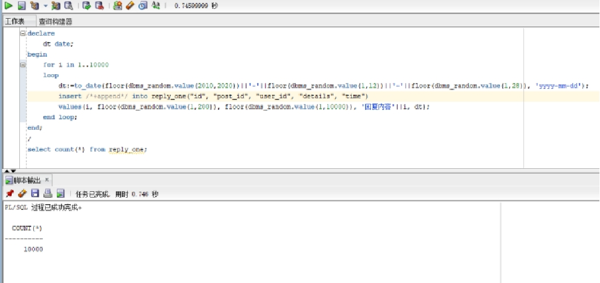

```sql
4.回贴表 reply2

DROP TABLE reply2;
CREATE TABLE reply2 (
  "id" NUMBER VISIBLE NOT NULL ,
  "post_id" NUMBER VISIBLE NOT NULL ,
  "reply_id" NUMBER VISIBLE NOT NULL ,
  "user_id" NUMBER VISIBLE NOT NULL ,
  "details" VARCHAR2(255 BYTE) VISIBLE NOT NULL ,
  "time" DATE VISIBLE NOT NULL 
)
TABLESPACE "SPACE01"
LOGGING
NOCOMPRESS
PCTFREE 10
INITRANS 1
STORAGE (
  BUFFER_POOL DEFAULT
)
PARALLEL 1
NOCACHE
DISABLE ROW MOVEMENT
;
COMMENT ON COLUMN reply2."id" IS '再次回复的id';
COMMENT ON COLUMN reply2."post_id" IS '话题id';
COMMENT ON COLUMN reply2."reply_id" IS '回复的id';
COMMENT ON COLUMN reply2."user_id" IS '用户id';
COMMENT ON COLUMN reply2."details" IS '回复内容';
COMMENT ON COLUMN reply2."time" IS '回复时间';

ALTER TABLE reply2 ADD CONSTRAINT "SYS_C0038680" PRIMARY KEY ("id", "post_id", "reply_id");

-- ----------------------------
-- Checks structure for table reply2
-- ----------------------------
ALTER TABLE reply2 ADD CONSTRAINT "SYS_C0038674" CHECK ("id" IS NOT NULL) NOT DEFERRABLE INITIALxfx IMMEDIATE NORExfx VALIDATE;
ALTER TABLE reply2 ADD CONSTRAINT "SYS_C0038675" CHECK ("post_id" IS NOT NULL) NOT DEFERRABLE INITIALxfx IMMEDIATE NORExfx VALIDATE;
ALTER TABLE reply2 ADD CONSTRAINT "SYS_C0038676" CHECK ("reply_id" IS NOT NULL) NOT DEFERRABLE INITIALxfx IMMEDIATE NORExfx VALIDATE;
ALTER TABLE reply2 ADD CONSTRAINT "SYS_C0038677" CHECK ("user_id" IS NOT NULL) NOT DEFERRABLE INITIALxfx IMMEDIATE NORExfx VALIDATE;
ALTER TABLE reply2 ADD CONSTRAINT "SYS_C0038678" CHECK ("details" IS NOT NULL) NOT DEFERRABLE INITIALxfx IMMEDIATE NORExfx VALIDATE;
ALTER TABLE reply2 ADD CONSTRAINT "SYS_C0038679" CHECK ("time" IS NOT NULL) NOT DEFERRABLE INITIALxfx IMMEDIATE NORExfx VALIDATE;
```
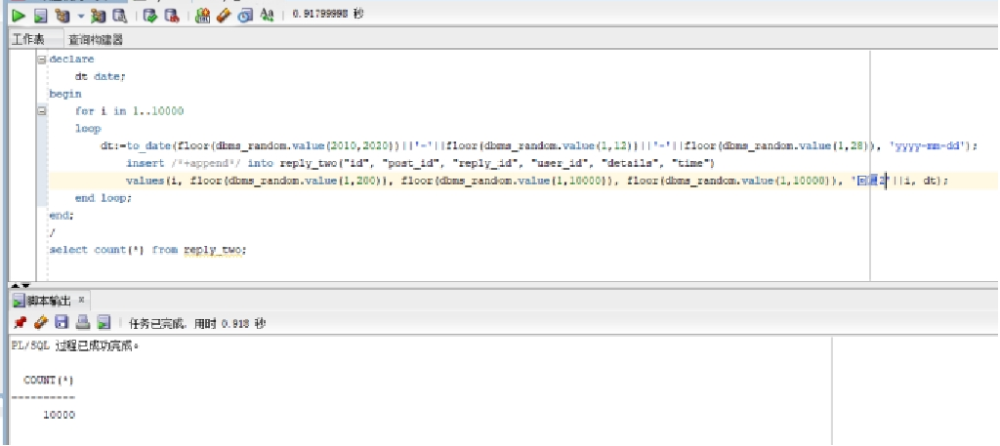

```sql
5.用户表

DROP TABLE user_table;
CREATE TABLE user_table (
  "id" NUMBER VISIBLE NOT NULL ,
  "user_name" VARCHAR2(255 BYTE) VISIBLE NOT NULL ,
  "sex" VARCHAR2(255 BYTE) VISIBLE 
)
TABLESPACE "SPACE01"
LOGGING
NOCOMPRESS
PCTFREE 10
INITRANS 1
STORAGE (
  BUFFER_POOL DEFAULT
)
PARALLEL 1
NOCACHE
DISABLE ROW MOVEMENT
;
COMMENT ON COLUMN user_table."id" IS '用户id';
COMMENT ON COLUMN user_table."user_name" IS '用户名';
COMMENT ON COLUMN user_table."sex" IS '用户性别';

ALTER TABLE user_table ADD CONSTRAINT "SYS_C0038687" PRIMARY KEY ("id");

-- ----------------------------
-- Checks structure for table user_table
-- ----------------------------
ALTER TABLE user_table ADD CONSTRAINT "SYS_C0038685" CHECK ("id" IS NOT NULL) NOT DEFERRABLE INITIALxfx IMMEDIATE NORExfx VALIDATE;
ALTER TABLE user_table ADD CONSTRAINT "SYS_C0038686" CHECK ("user_name" IS NOT NULL) NOT DEFERRABLE INITIALxfx IMMEDIATE NORExfx VALIDATE;
```
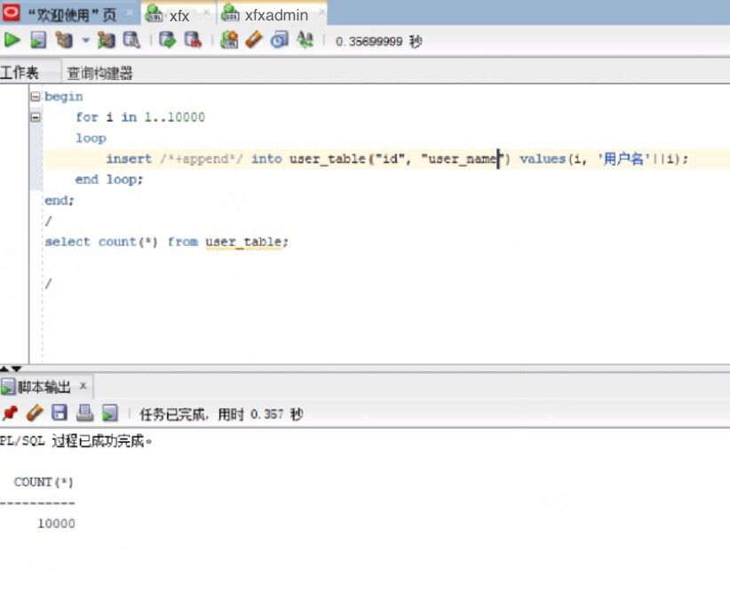

##### 六、PL/SQL语言设计存储过程和函数：
```sql
1.函数
create or replace PACKAGE MyPack IS
  --获取一个用户的发起的话题、回复、再回复总数
  FUNCTION get_posts_num_of_users(user_id int) RETURN int;
  --按照结构显示一个话题
  PROCEDURE show_post(post_id int);
  END MyPack;
```
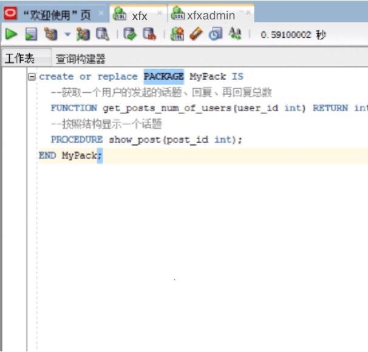
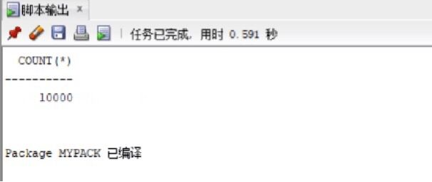

```sql
2.存储过程
create or replace PACKAGE BODY MyPack IS
  FUNCTION get_posts_num_of_users(user_id int) RETURN int
  AS
    posts int;
    reply1 int;
    reply2 int;
    begin
      select count(*) into posts from post where "user_id" = user_id;
      select count(*) into reply1 from post where "user_id" = user_id;
      select count(*) into reply2 from post where "user_id" = user_id;
      return posts+reply1+reply2;
    end;
  PROCEDURE show_post(post_id int)
  AS
    temp varchar2(255);
    leftspace varchar2(255);
    begin
      leftspace:='   ';
      select "title" into temp from post where "id"=post_id;
      DBMS_OUTPUT.PUT_LINE('标题：'||temp);
      select "details" into temp from post where "id"=post_id;
      DBMS_OUTPUT.PUT_LINE('细节：'||temp);
      for v in (select * from reply1 where "post_id"=post_id)
      loop
        DBMS_OUTPUT.PUT_LINE(leftspace||'用户'||v."user_id"||'回复：'||v."details");
      end loop;
    END;
END MyPack;
```
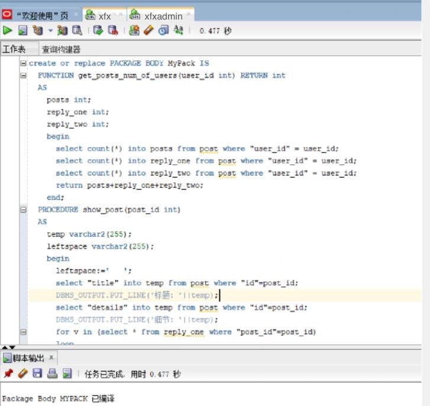

##### 七．备份方案：
    数据库备份采取每月一次进行数据库全备份，并且在每日凌晨十二点自动开始增量备份的方式进行备份。
```sql
1.开始全备份
全库0级备份
[oracle@deep02~]$ sqlplus study/123@pdborcl
run{
configure retention policy to redundancy 1;
configure controlfile autobackup on;
configure controlfile autobackup format for device type disk to '/home/student/rman_backup/%F';
configure default device type to disk;
crosscheck backup;
crosscheck archivelog all;
allocate channel c1 device type disk;
allocate channel c2 device type disk;
allocate channel c3 device type disk;
backup incremental level 0 database format '/home/student/rman_backup/level0_%d_%T_%U.bak';
report obsolete;
delete noprompt obsolete;
delete noprompt expired backup;
delete noprompt expired archivelog all;
release channel c1;
release channel c2;
release channel c3;
}
全库1级增量备份
run{
configure retention policy to redundancy 1;
configure controlfile autobackup on;
configure controlfile autobackup format for device type disk to '/home/student/rman_backup/%F';
configure default device type to disk;
crosscheck backup;
crosscheck archivelog all;
allocate channel c1 device type disk;
allocate channel c2 device type disk;
allocate channel c3 device type disk;
backup incremental level 1 database format '/home/student/rman_backup/level1_%d_%T_%U.bak';
report obsolete;
delete noprompt obsolete;
delete noprompt expired backup;
delete noprompt expired archivelog all;
release channel c1;
release channel c2;
release channel c3;
}

2. 备份后修改数据
[oracle@deep02~]$ sqlplus xfx/123@pdborcl
SQL> create table t1 (id number,name varchar2(50));
Table created.
SQL> insert into t1 values(1,'zhang');1 row created.
SQL> commit;
Commit complete.
SQL> select * from hr.mytable;

        ID NAME
---------- --------------------------------------------------
         1 zhang
         2 wang
SQL> exit
```
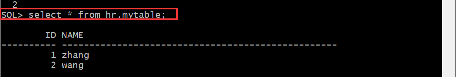

```sql
3.数据库完全恢复
oracle登录linux,不是student用户,dedicated专用连接模式
需要全库停机，需要oracle用户
sys登录到orcl，查看全库的数据文件
$ sqlplus / as sysdba
SQL> select file_name from dba_data_files;
- 全库停机
$rman target /
RMAN> shutdown immediate;  或者 shutdown abort;
RMAN> exit

- 数据文件改名，模拟文件损失
$mv /home/student/pdb_xfx/pdbtest_users02_1.dbf  /home/student/pdb_xfx/pdbtest_users02_1.dbf2

- 全库恢复
$rman target /
RMAN> startup mount;
RMAN> restore database;
RMAN> recover database;
RMAN> alter database open;
4.单库完全恢复/不完全恢复
$ sqlplus system/123@202.115.82.8/xfx
SQL> select file_name from dba_data_files;
/home/student/pdb/ xfx /system01.dbf
/home/student/pdb/ xfx /sysaux01.dbf
/home/student/pdb/ xfx /undotbs01.dbf
/home/student/pdb/ xfx /users01.dbf
/home/student/pdb/pdbtest_users02_1.dbf
/home/student/pdb/pdbtest_users02_2.dbf
/home/student/pdb_xfx/pdbtest_users02_1.dbf
/home/student/pdb_xfx/pdbtest_users02_2.dbf
SQL> select * from xfx.mytable;
        ID NAME
---------- --------------------------------------------------
         3 zhang
         4 wang
         5 xie
SQL> select to_char(sysdate,'yyyy-mm-dd hh24:mi:ss') as currentdate from dual;
CURRENTDATE
-------------------
2021-06-14 08:02:24
SQL> update xfx.mytable set id=id+1;
SQL> commit;
SQL> select * from xfx.mytable;
        ID NAME
---------- --------------------------------------------------
         4 zhang
         5 wang
         6 xie
SQL> select to_char(sysdate,'yyyy-mm-dd hh24:mi:ss') as currentdate from dual;
CURRENTDATE
-------------------
2021-06-14 08:03:01
SQL> exit;
- 关闭xfx数据库
```
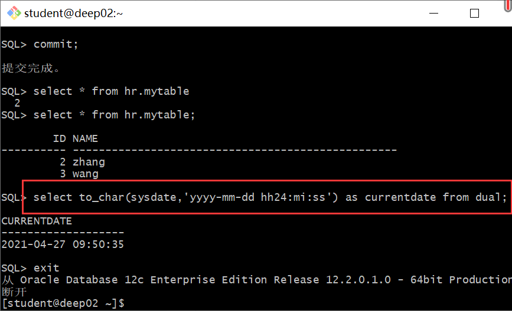

```sql
$rman target sys/123@202.115.82.8/orcl:dedicated
RMAN> alter pluggable database xfx close;
RMAN> exit;
或者
$sqlplus sys/123@202.115.82.8/orcl:dedicated as sysdba;
SQL>SELECT server FROM v$session WHERE  SID=(SELECT DISTINCT SID FROM v$mystat);
SQL>alter session set container=xfx;
SQL>shutdown immediate; 或者 shutdown abort;
```
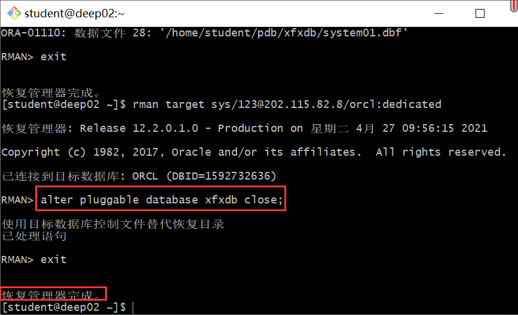
```sql
- 数据文件改名，模拟文件损失
$mv -f /home/student/pdb_xfx/pdbtest_users02_1.dbf  /home/student/pdb_xfx/pdbtest_users02_1.dbf2

- 选项1：单库完全恢复
$rman target sys/123@202.115.82.8/orcl:dedicated
RMAN> restore pluggable database xfx;
RMAN> recover pluggable database xfx;
RMAN> alter pluggable database xfx open;
RMAN> exit;

- 完全恢复成功后，xfx用户登录xfx，
$ sqlplus xfx/123@202.115.82.8/xfx
SQL> select * from mytable;
        ID NAME
---------- --------------------------------------------------
         4 zhang
         5 wang
         6 xie

可见，完全恢复成功，数据是最新的（即2021-06-14 09:23:01），无损失。


## 选项2：单库不完全恢复,恢复到update语句之前的状态，即恢复到2021-06-14 08:02:24时刻的数据
$rman target sys/123@202.115.82.8/orcl:dedicated
RMAN> restore pluggable database xfx;
RMAN> recover pluggable database xfx until time "to_date('2021-06-14 08:02:24','yyyy-mm-dd hh24:mi:ss')" AUXILIARY DESTINATION '/home/student/zwd';
正在开始介质的恢复
线程 1 序列 1624 的归档日志已作为文件 /home/oracle/app/oracle/product/12.2.0/dbhome_1/dbs/arch1_1624_1064951903.dbf 存在于磁盘上
线程 1 序列 1625 的归档日志已作为文件 /home/oracle/app/oracle/product/12.2.0/dbhome_1/dbs/arch1_1625_1064951903.dbf 存在于磁盘上
RMAN> alter pluggable database xfx open resetlogs;
已处理语句
RMAN>exit
- 不完全恢复成功后，xfx用户登录xfx，
$ sqlplus xfx/123@202.115.82.8/xfx
SQL> select * from mytable;
        ID NAME
---------- --------------------------------------------------
         3 zhang
         4 wang
         5 xie
可见，不完全恢复成功，数据回到了修改前的状态.
```

  
   


